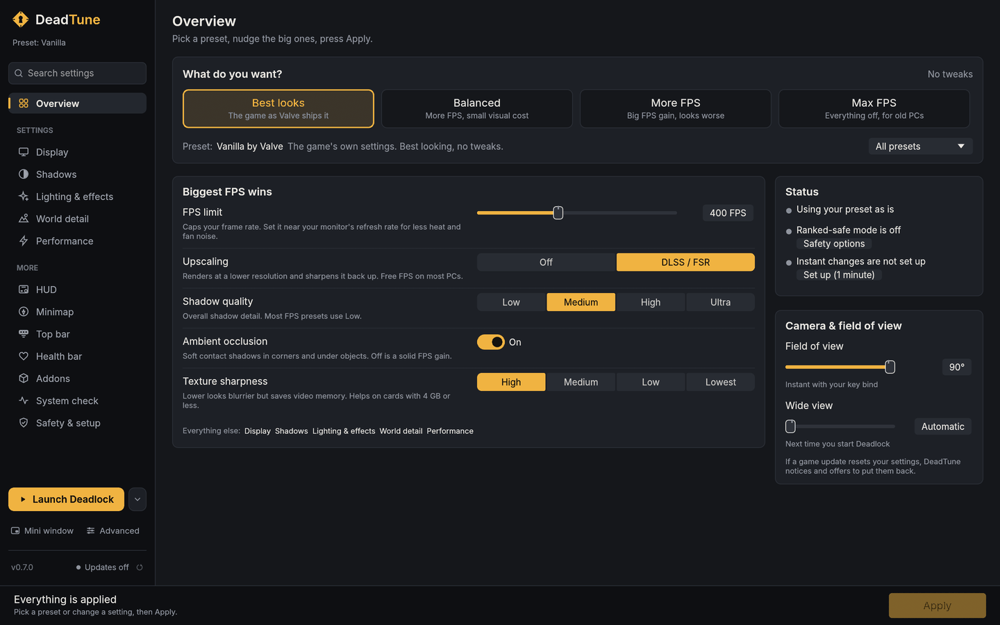
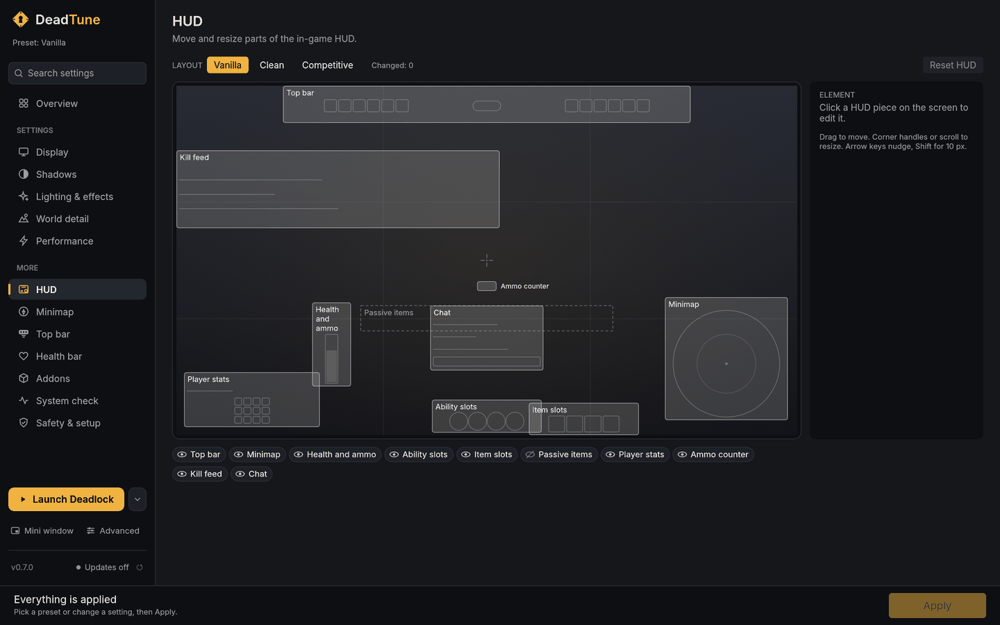
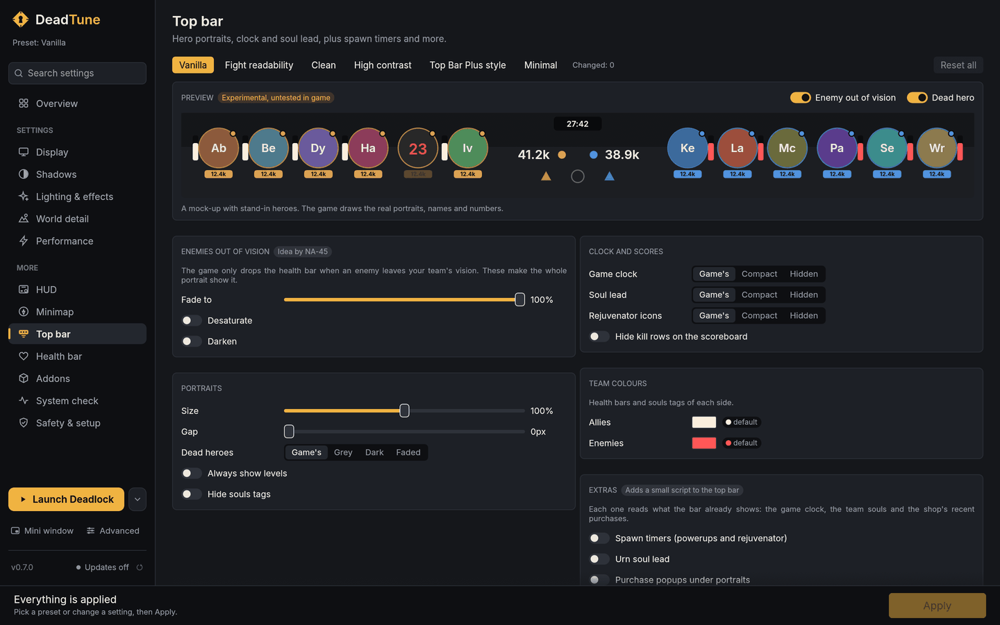
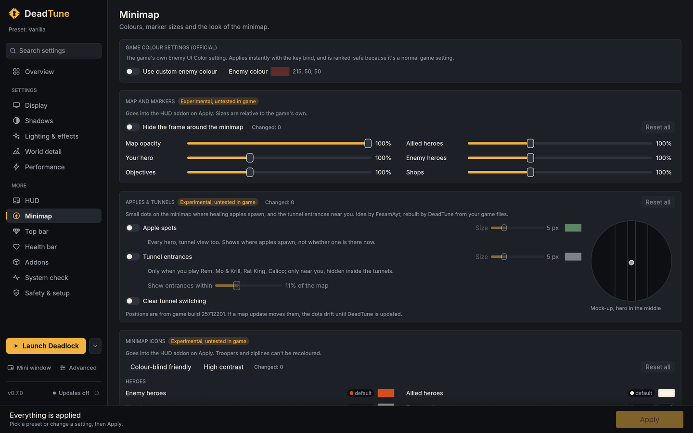
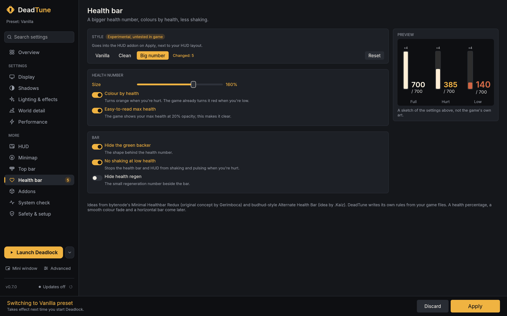
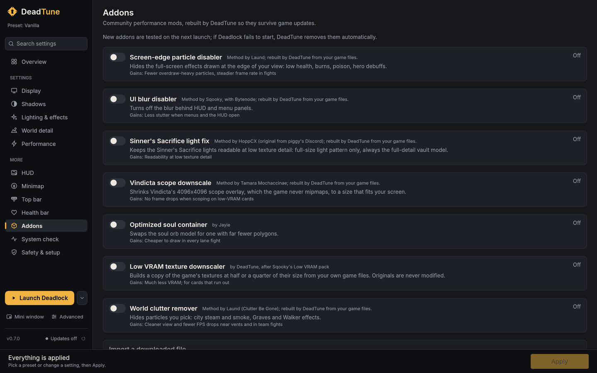
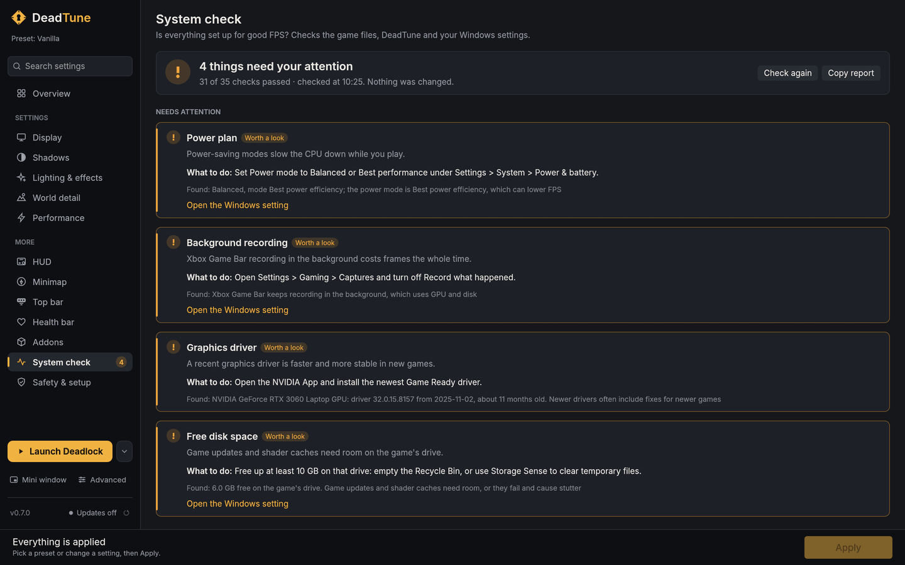
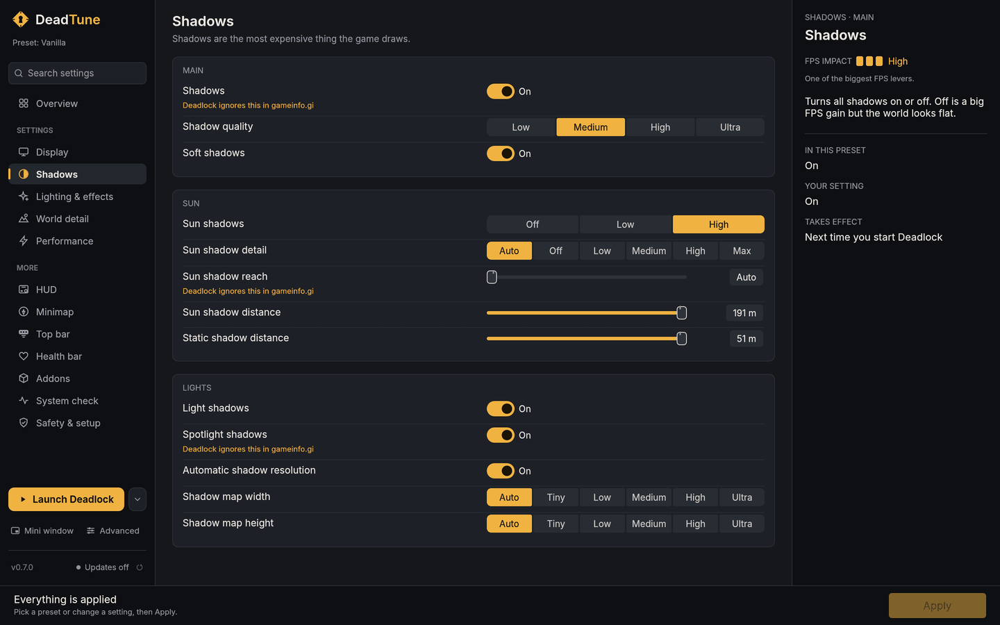
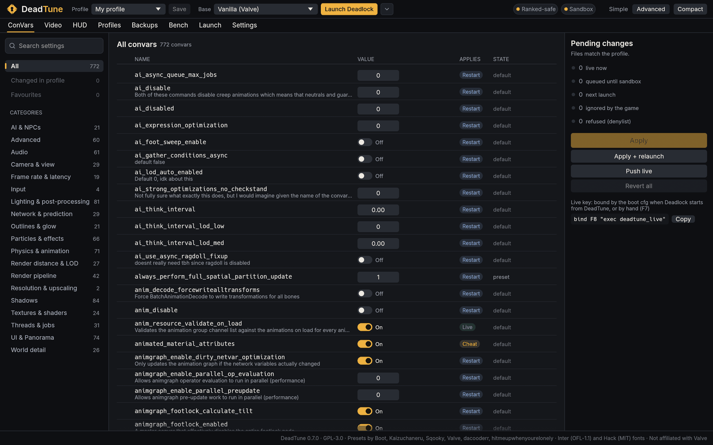

<div align="center">

# DeadTune

**Tune Deadlock for more FPS, and make the HUD yours. One small app, no installer, nothing injected into the game.**

[](LICENSE)
[](https://www.rust-lang.org)
[](#install)
[](https://github.com/emilk/egui)
[](#safety-first)
[](#install)
[](#status)



</div>

---

## Why DeadTune

Deadlock's best performance tweaks live in two files: `gameinfo.gi` and `video.txt`. The community presets that edit them work, but using them means copying files by hand, losing your changes on every game update, and guessing which of 700+ settings actually matter.

DeadTune turns that into an app:

- **Start from a proven preset**, then change only what you care about.
- **See what each setting does** and what it costs, in plain words.
- **Apply in one click.** Your original files are backed up first, and one more click puts everything back.
- **Keep your setup after game updates.** DeadTune notices when Steam overwrites your config and offers to re-apply it.
- **Make the HUD yours**: move and resize it, restyle the top bar, minimap and health bar. No ConVar can do that.
- **Check your PC** for the Windows settings that quietly cost FPS.

## Features

### Performance tuning

- **Nine community presets** to start from: Vanilla, Sqooky (stable and testing), Kaizuchaneru minimum spec and extreme low, Boot max FPS, OptiLock recommended and potato, and SideLock. Authors are credited in the app. SideLock's licence doesn't allow shipping it, so DeadTune downloads the author's file from GameBanana and checks it against a pinned hash.
- **Simple view** grouped the way players think: Display, Shadows, Lighting and effects, World detail, Performance. The biggest FPS wins sit on the Overview page, next to a **Camera and field of view** card (field of view and wide view).
- **Practice mode** for bots, sandbox and unranked: since the September 2026 update the game ignores the big shadow and fog ConVars in `gameinfo.gi`, so practice mode turns shadows, fog and batching down in the `SceneSystem` section instead, the way SideLock does. Matchmaking may refuse to queue while it is on; Ranked-safe mode puts the stock values back in one click.
- **Advanced view** with every one of the **772 catalogued ConVars**, searchable, with type-aware controls, defaults, preset values and an impact rating.
- **Honest apply classes.** Each setting is tagged *live*, *live in sandbox*, *needs restart* or *ignored* (the game no longer reads it from `gameinfo.gi`), so you know when a change takes effect and whether it does anything.
- **Profiles** stored as small TOML files. Import and export Sqooky's `overrides.gi` format, so you can switch between his updater and DeadTune.

### HUD, top bar, minimap and health bar



- **Drag to place** the top bar, minimap, ability slots, item slots, passive items, health, player stats, ammo counter, kill feed and chat on a 16:9 preview.
- **Scale, fade or hide** each element. Show panels the game hides by default, like passive item slots.
- **Built from your own game files.** DeadTune patches the stylesheet from your installed Deadlock and packs it into one addon. A game update never leaves stale copies behind; DeadTune rebuilds it.
- **208 HUD ConVars** in the same place: crosshair style, minimap icons, overhead health bars, damage numbers. Settings that reveal extra enemy information are blocked.
- **Conflict warnings** when another HUD mod (QoL Lite, QoL Lock) replaces the same file.
- **Top bar page** (experimental): fade, grey or darken enemies out of vision (idea by NA-45), dead hero look, portrait size and gap, team colours, compact or hidden clock, soul lead and rejuvenator rows, and optional spawn timers, urn soul lead and purchase popups (ideas by Stovven and bonclide), all previewed live on a mock of the bar.



- **Minimap page**: the game's own enemy colour setting, per-icon colours with colour-blind and high-contrast presets, marker sizes for heroes, objectives and shops, map opacity and a frameless minimap (ideas from BetterMap by gfkm), plus **Apples and tunnels**: dots for apple spawns and nearby tunnel entrances for Rem, Mo & Krill, Rat King and Calico (idea by FesamAyt). Experimental.



- **Health bar page** (experimental): Vanilla, Clean and Big number presets, health number size, orange when hurt, easy-to-read max health, no shaking at low health, with a preview at full, hurt and low health (ideas from bytenode's health bar mods, after Gerimboca and .Kaiz).



All of these are written from scratch against your installed game files and go into the same single HUD addon; the mods that inspired them are credited in the app and stay their authors' work.

### Performance addons

The community's performance mods, each as one DeadTune-owned pak file that comes off with one click:

- **Rebuilt from your game files, method by the original author.** The screen-edge particle disabler and the world clutter remover (Laund, after his Clutter Be Gone packs), the UI blur disabler (Sqooky, with Bytenode), the Sinner's Sacrifice light fix (HoppCX) and the Vindicta scope downscale (Tamara Mochaccinae) are made from your own `pak01` on Apply, so they never go stale: after a game update DeadTune rebuilds them. No download.
- **Pick what to hide.** The particle disabler is split into groups (low-health vignette, burns, hero debuffs); the clutter remover covers city steam and smoke, Graves and Walker effects, or everything for offline play; the blur disabler covers HUD and menus separately; the scope size is yours to choose.
- **The optimized soul container** by Jayie is a hand-made model, so it stays a download from Sqooky's repository (or an import of the file).
- **Low VRAM texture downscaler** (after Sqooky's Low VRAM pack): builds a copy of the game's textures at half or a quarter of their size from your own game files, for graphics cards that run out of memory. Originals are never modified.
- **Checked before and after.** Every pak is read back against your game files before it goes into the game folder, and the next launch is a trial: if Deadlock fails to start, DeadTune removes the new addon and tells you. A safe-mode launch from the menu beside Launch takes every DeadTune pak out until you restore them.



### System check

A plain-language check of everything that affects your FPS, with what to do for each problem:

- **Deadlock files, HUD and addons, DeadTune**: the game install, its settings files, the HUD addon, mods from other tools, and your backups.
- **Windows and hardware** (read only, DeadTune never changes Windows settings): power plan, graphics card choice on laptops, monitor refresh rate, Game Bar background recording, RAM speed and sticks, overlays, graphics driver age, Game Mode, memory integrity, windowed game optimizations, GPU scheduling, SSD or hard drive, free disk space, and Steam processing shaders in the background.
- **Steam launch options** that override DeadTune's settings, read from Steam's own config.
- Each warning links to the right Windows Settings page. **Copy report** gives a plain-text report for bug reports.



### Testing and comparing

- **Live changes** for settings the engine accepts at runtime, through an exec file bound to a key (default `F8`), the network console where it works, or the clipboard.
- **Apply and relaunch** for restart-only settings: DeadTune closes the game, writes the files and starts it again.
- **Launch options** in the menu beside Launch: DirectX 11 or Vulkan, skip the intro video, the console window and your own extras, each checked against the options this game build actually knows.
- **Benchmarks**: import PresentMon (Windows) or MangoHud (Linux) captures and compare average FPS, 1% and 0.1% lows between runs and profiles.
- **Mini window**: a compact always-on-top mode with search, favourites and Push, for use next to the game in borderless windowed.

### Everyday convenience

- **Finds the game** through Steam on its own, including extra libraries and Flatpak Steam on Linux.
- **Game update detection** through the Steam build id and file hashes.
- **Updates itself**: the sidebar shows the version and whether a new one is out; updates are signed and checked before they install.
- **Power profiles**: pick a profile for plugged in and one for battery.
- **System check** (and `deadtune-cli doctor`) for a new machine. It writes nothing into the game.
- **Command-line twin** (`deadtune-cli`) with the same core, for scripts and Linux users.



## Safety first

DeadTune only works through files, launch options and the official console.

| DeadTune does | DeadTune never does |
|---|---|
| Edit the `ConVars` block in `gameinfo.gi` and settings in `video.txt` | Inject DLLs or read/write game memory |
| Add one DeadTune-owned addon file for HUD changes | Draw an overlay inside the game process |
| Back up every file before writing, keep the original forever | Touch settings that show enemies through walls or reveal hidden information |
| Validate braces and refuse to write a broken file | Edit anything outside the `ConVars` and `SearchPaths` blocks (mod manager edits survive) |

**Matchmaking.** Edited ConVars do not block matchmaking (checked on Windows). Since March 2026 the game only refuses to queue when the `Engine2`, `MaterialSystem2`, `NetworkSystem`, `Particles`, `RenderSystem`, `SceneSystem` or `WorldRenderer` sections of `gameinfo.gi` are changed, or the game runs in Tools mode. DeadTune never edits those sections. Since September 2026 the game also ignores 77 ConVars when they are set in `gameinfo.gi` (shadows, fog, outlines, glow and others). DeadTune marks these as *ignored*, so you can see which preset lines no longer do anything.

**No ads, no analytics, no tracking.** DeadTune collects nothing about you or your PC and has no telemetry. It goes online only to check GitHub for a new version and to download presets and the soul container addon from their authors' GitHub repos. Those requests send nothing about you.

**Ranked-safe mode.** If Valve tightens the rules again, one click restores the stock ConVars block and removes the HUD addon, while keeping your `video.txt` settings (those are normal menu options). One more click brings your profile back.

## Install

DeadTune is a single executable (about 9 MB, a 6.2 MB download). There is no installer and no runtime to install.

| Platform | Status |
|---|---|
| Windows 10/11 x64 | Main target |
| Linux x64 and Steam Deck | Supported (Deadlock runs through Proton) |
| macOS | Developer builds only; Deadlock has no macOS version |

1. Download `deadtune-windows-x64.zip` from [Releases](../../releases).
2. Unzip it anywhere and double-click `deadtune.exe`.
3. If Windows shows "Windows protected your PC", click **More info**, then **Run anyway**. The app is not code-signed yet.

Testers: see [docs/testing-windows.md](docs/testing-windows.md) for the testing channel.

## Command line

```text
deadtune-cli doctor                      self test; writes nothing into the game
deadtune-cli status                      game, power, file state, HUD addon, pending changes
deadtune-cli catalog <search>            search ConVars by name or description
deadtune-cli diff --profile laptop.toml  show what apply would do
deadtune-cli apply --profile laptop.toml write the profile and push live changes
deadtune-cli ranked-safe                 stock ConVars and SceneSystem values, HUD addon removed
deadtune-cli practice on|off             practice mode (shadows, fog, batching) in a profile
deadtune-cli presets fetch|import        download or import a remote preset (SideLock)
deadtune-cli launch-options check        which launch options this game build knows
deadtune-cli restore                     restore or list backups
deadtune-cli hud apply|remove|status     manage the HUD addon
deadtune-cli addons list|enable|verify   performance addons
deadtune-cli bench import|list|compare   benchmark captures
deadtune-cli watch                       report game updates and overwritten files
```

Run `deadtune-cli --help` or `deadtune-cli <command> --help` for every option.

<details>
<summary><b>Example profile</b></summary>

```toml
name = "Laptop / battery"
base = "kaiz_minspec"

[convars.set]
r_farz = "6000"
fps_max = "60"

[video]
"setting.r_texture_stream_mip_bias" = "4"

[hud.elements.minimap]
scale_pct = 120

[hud.elements.passive_items]
visibility = "shown"
```

</details>

## Build from source

```sh
git clone https://github.com/simulieren/deadtune.git
cd deadtune
cargo run -p dt-gui --release           # the app
cargo run -p dt-cli --release -- --help # the CLI
cargo test --workspace
```

Cross-compile the Windows build on macOS or Linux (needs `mingw-w64` and the `x86_64-pc-windows-gnu` target):

```sh
scripts/release-local.sh --no-upload    # zip in target/release-local/
```

No Deadlock install? `scripts/fake-install.sh` builds a fake game folder to run against.

<details>
<summary><b>Project layout</b></summary>

| Path | What it is |
|---|---|
| `crates/dt-core` | Everything except UI: config editors, catalog, profiles, backups, apply engine, HUD addon builder. No module touches the game process. |
| `crates/dt-gui` | The egui app (`deadtune.exe`) |
| `crates/dt-cli` | The command-line app (`deadtune-cli`) |
| `catalog/` | ConVar metadata, generated from community dumps plus hand curation |
| `research/` | Presets, ConVar dumps and HUD format notes the app was built from |
| `docs/` | Plans and the Windows testing guide |

</details>



## Status

DeadTune is in **alpha**. The core, CLI and GUI work against a fake install and the test suite. In-game checks are still open for:

- the experimental HUD pages (top bar, minimap styling, apples and tunnels, health bar), which are marked as such in the app;
- whether matchmaking refuses to queue with practice mode on;
- which live console paths work on Windows without `-tools`.

In progress: a health percentage and a horizontal health bar, and a phone remote (`--features remote`) for tweaking while the game stays fullscreen.

## Credits

DeadTune stands on the work of the Deadlock tuning community:

- [Sqooky/OptimizationLock](https://github.com/Sqooky/OptimizationLock): presets, the override model DeadTune's `gameinfo.gi` editor is ported from, and the performance addons bundle whose methods DeadTune rebuilds (Laund, Sqooky with Bytenode, HoppCX, Tamara Mochaccinae, Jayie)
- [dacooderr/OptiLock](https://github.com/dacooderr/OptiLock): presets including `video.txt` tuning
- Kaizuchaneru and Boot: minimum-spec and max-FPS presets
- [Laund](https://gamebanana.com/mods/722853): the screen-edge particle disabler and Clutter Be Gone, whose effect lists DeadTune's particle cleanup uses
- hitmeupwhenyourelonely: the SideLock config, downloaded from its GameBanana page
- HUD ideas: NA-45, Stovven and bonclide (top bar), [gfkm](https://gamebanana.com/mods/664456) (BetterMap: minimap sizes and opacity), FesamAyt (apples and tunnels), [bytenode](https://gamebanana.com/mods/653671) with Gerimboca and .Kaiz (health bar styles). DeadTune writes its own versions; the original mods are their authors' work.
- [Deadlock Mod Manager](https://github.com/deadlock-mod-manager/deadlock-mod-manager): reference for KeyValues handling and Steam paths
- [ValveResourceFormat](https://github.com/ValveResourceFormat/ValveResourceFormat): the reference for compiled resource and VPK formats
- [Inter](https://rsms.me/inter/) by Rasmus Andersson (SIL OFL 1.1), the UI font

DeadTune is not affiliated with or endorsed by Valve. Deadlock is a trademark of Valve Corporation.

## License

[GPL-3.0](LICENSE). The presets DeadTune builds on are GPL-3.0 as well.
