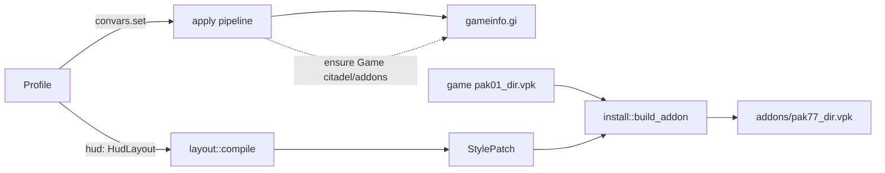

# DeadTune HUD editing plan

Extends PLAN.md. Goal: let the user move, scale, fade and hide the HUD pieces they see in game (top bar, minimap, ability slots, item slots, health and ammo, stats, kill feed, chat) and tune the HUD ConVars (crosshair, minimap icons, overhead bars, damage numbers), with the same safety model as the rest of DeadTune: files only, no process access, one click back to vanilla.

Status: plan v1, 2026-10-04. Research: `research/hud/` (reports plus the Python spike scripts that produced them).

## 1. What the research says

| Question | Answer | Confidence |
|---|---|---|
| How do HUD mods work? | Panorama overrides in an addon VPK at `game/citadel/addons/pakNN_dir.vpk`, mounted by `Game citadel/addons` in `gameinfo.gi` SearchPaths. | Verified in 9 mod VPKs and DMM code |
| Can ConVars move or resize HUD panels? | No. 376 HUD ConVars exist, none for position or scale of the minimap, top bar, abilities or items. | Verified against both dumps |
| What can ConVars do? | Crosshair style, minimap icon sizes, top bar variant, overhead health bars, damage numbers, `citadel_hud_visible`. | Verified |
| Do we need Valve's `resourcecompiler`? | Not for CSS. A `.vcss_c` holds minified CSS in its DATA block behind a 6-byte prefix (`u32 crc`, `u16 0`). We clone the game's own file, swap the text, recompute the prefix. Rebuilt files are byte-identical on unchanged text and decompile cleanly in Source2Viewer. | Verified offline, not yet in game |
| Layout (`.vxml_c`) or JS edits? | Out of scope. Layouts are a KV3 binary AST (LZ4); a bad one breaks the whole HUD. CSS covers move, scale, fade, hide, size. | Verified format; decision |
| Matchmaking risk? | The known block names only `gameinfo.gi` ConVar changes and `-tools`. Nothing found against addon VPKs. | Inferred, test in Phase 0 |
| Existing tools? | QoL Lite / QoL Lock (config toggles, ship stale vanilla copies, QoL Lock talks to a remote web page), mntbliss QoL HUD (JSON + Valve compiler). No visual drag-to-place editor exists. | Verified |

The crosshair ConVars are `cl, a` in `cvarlist.txt` but `developmentonly` in `convars.txt`. Until Phase 0 settles it they are `restart` (written to `gameinfo.gi`), per the "most conservative dump wins" rule in `hud::convars`.

## 2. Design

### 2.1 Two levers, one tab



- **HUD ConVars** are ordinary catalog entries with an `element` tag (`catalog/hud.toml`). They flow through the existing profile and apply pipeline unchanged.
- **Layout edits** compile to CSS. The CSS is appended to the text of the game's own `panorama/styles/hud.vcss_c`, read from the installed `pak01_dir.vpk`, and packed into one DeadTune-owned addon. No stale vanilla copies: we rebuild from the live game file whenever `buildid` changes.

### 2.2 Data shape

```rust
pub struct HudLayout {
    pub elements: BTreeMap<ElementId, ElementEdit>,   // identity edits emit nothing
    pub extra_css: BTreeMap<String, String>,          // advanced, per style file
}
pub struct ElementEdit { visibility: Visibility, offset_x: i32, offset_y: i32, scale_pct: u16, opacity_pct: u8 }
pub enum Visibility { Vanilla, Hidden, Shown }
```

`ElementId` rows live in one table, `hud::elements::ELEMENTS`: selector, scale property, vanilla box at 1080p for the preview canvas, notes. Adding an element is one row.

| Element | Selector | Notes |
|---|---|---|
| Top bar | `#TopBar` | Hero portraits, score, timer |
| Minimap | `#minimap_persp` | Scaled with `pre-transform-scale2d` from the bottom-right corner; TAB big map keeps vanilla (higher specificity) |
| Health and ammo | `#health_and_abilities_container` | |
| Ability slots | `#hud_signature` | Vanilla rule collapses it; check which state shows it |
| Item slots | `#ActiveAbilitiesMenu` | Active items 1 to 4 |
| Passive items | `#hud_passive_items` | Collapsed in vanilla; `Shown` reveals it |
| Player stats | `#StatsAndModsContainer` | Lower-left stats and purchased mods |
| Ammo counter | `#ammo_panel` | |
| Kill feed | `#DataFeed` | |
| Chat | `#Chat` | |

CSS emitted per edit: `transform:translateX(..px) translateY(..px)`, `ui-scale` or `pre-transform-scale2d`, `opacity`, `visibility:collapse|visible`.

### 2.3 Module map (`crates/dt-core/src/hud/`)

| Module | Owns |
|---|---|
| `crc32` | zlib CRC-32, no new dependency |
| `vpk` | VPK v2 reader (game's split archives) and single-file writer |
| `resource` | compiled resource parse/rebuild, style text swap with prefix recompute |
| `css` | minify, parse rules, read vanilla declarations, emit rules |
| `elements` | the element table |
| `layout` | `HudLayout`, validation, `compile`, `preview` rects |
| `searchpaths` | ensure `Game citadel/addons` in gameinfo SearchPaths (pure text) |
| `install` | plan/execute/uninstall of `addons/pak77_dir.vpk`, install record, conflict scan |
| `convars` | embedded `catalog/hud.toml` |

### 2.4 Integration points for the core agent

- `Profile` gains `#[serde(default)] pub hud: dt_core::hud::HudLayout`.
- The apply pipeline calls `hud::install::plan`, shows the plan next to the gameinfo diff, chains `hud::searchpaths::ensure_addons` into the gameinfo text when `needs_search_path`, and calls `hud::install::execute`.
- "Ranked-safe mode" removes our addon too (plan with a vanilla layout returns `HudAction::Remove`).
- The watcher treats a `buildid` change as `InstalledState::Stale` and offers a rebuild.
- GUI HUD tab: a 16:9 canvas from `layout::preview`, drag to move, wheel to scale, per-element toggles and sliders, plus the HUD ConVars grouped by `element`. Conflicts (another addon overriding `hud.vcss_c`, e.g. QoL Lite/Lock) shown as a warning.
- CLI: `dt hud apply|remove|status --layout hud.toml`.

## 3. Safety

- One addon file, recognised by the sha256 in `data_dir()/hud.toml`. Never overwrite a file at our path we did not write.
- Never write a stylesheet whose extra CSS fails brace balance.
- The SearchPaths edit touches only the SearchPaths block, inserts one line, and is a no-op when already present.
- Vanilla layout means no addon at all.

## 4. Phases

### Phase H0: in-game spikes (needs the real game)

Use `cargo run -p dt-core --example hud_build -- <game root> <layout.toml>` to produce the test VPK.

1. Does a generated `hud.vcss_c` (one appended `#minimap_persp` rule) load? If not, try prefix = `crc32(text)`, then dropping SrMa.
2. Does `transform: translateX/Y` move panels, or is Panorama's `x`/`y` property needed?
3. Which addon number wins when two addons override the same file (pak77 vs pak01)?
4. Does a mounted addon (no ConVar changes) still allow matchmaking?
5. Crosshair ConVars: live from console or not?
6. Which game state shows `#hud_signature`? Vanilla collapses both it and `#hud_passive_items` with the same rule and reveals both via `.viewing_as_player` / `.ShowGoldAndAPOnHud`, which contradicts "passives are hidden in vanilla".
7. Do rules in `hud.vcss_c` reach `#ammo_panel`? It lives in `element_gun.xml` under `#crosshair` and may need `element_gun.vcss_c`.
8. Minimap scale: vanilla animates `pre-transform-scale2d` (`.InHideout` sets 0.9). Check that our value holds in matches. State rules with higher specificity (`.InHideout`, `.deathReplayActive`, `.gDetailView`) will win over ours by design.
9. The preview boxes for the top bar, ability, item, ammo, kill feed and chat panels are estimates (`notes` in `hud::elements`). Take a screenshot with the HUD in vanilla and correct the table rows.

### Phase H1: core (this branch)

All modules above with unit tests on real fixtures (`tests/fixtures/hud/`: a vanilla `hud.vcss_c`, a small mod `.vcss_c`, the Blur Disabler VPK) plus an end-to-end test against a fake install with a generated `pak01_dir.vpk`.

### Phase H2: wiring (core agent)

Profile field, apply pipeline, ranked-safe, watcher, CLI subcommand.

### Phase H3: GUI tab (core agent's GUI worker)

Canvas editor plus ConVar list, as in 2.4.

### Phase H4: later

- Per-aspect-ratio rules (`.AspectRatio16x10`, `.AspectRatio4x3` hooks).
- More elements (top bar sub-parts, souls counter, damage report) as table rows.
- Import a QoL Lite/Lock CSS stub as a starting layout.
