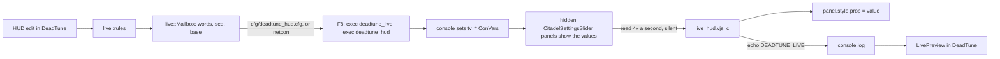

# Live HUD preview (restyle the running game's HUD without a restart)

Status: second build, 2026-10-06. The first Windows launch (v0.17.0, section 2) proved the script loads and can run console commands, and that Panorama has no ConVar read API. This build reads ConVars through hidden sliders instead (section 3). The LH checks in `docs/testing-windows.md` section 7e settle what is left. Research: `research/hud/panorama-runtime.md`, `docs/plans/ingame-settings/plan.md`.

## 1. The problem

Two facts fix the shape of this feature:

- The running game locks DeadTune's HUD pak (`pak77_dir.vpk`: "Access is denied (os error 5)" even as administrator), so nothing new can be shipped while the game runs.
- Retail Panorama has no reload command (`find reload`, `find panorama`: nothing; `dump_panorama_events` lists only generic style events). A pak change is seen at the next game start.

What Panorama does offer is `panel.style.<prop> = value` from a script that is already loaded, and every HUD edit DeadTune makes is a CSS rule, so a script shipped in the pak once can restyle the HUD at runtime if DeadTune can hand it the current rules.

## 2. Evidence from the first Windows launch

Simon, 2026-10-06, v0.17.0, preview on, game launched through DeadTune, minimap edited. `console.log`:

```
[InputService] exec: couldn't exec '{}cfg/deadtune_hud.cfg', unable to read file   (about once a second)
[Console] DEADTUNE_LIVE hello 285ebd44
[InputService] exec: couldn't exec '{}cfg/deadtune_hud.cfg', unable to read file
[Console] DEADTUNE_LIVE hello 285ebd44
```

The normal bridge worked alongside (`execing deadtune_live`, then `[Console] "DeadTune: applied 1"`). What it proves:

- The script loads from the HUD pak, and `$.DispatchEvent("CitadelConCommand", ...)` runs `exec` and `echo`.
- The hello line had no ` tv_title=` part, so `GameInterfaceAPI.GetSettingString` does not exist in Deadlock. Channel (a) of the first design is dead.
- Every `exec` prints a console line, so the old once-a-second exec spammed the log. Polling with `exec` is out.
- DeadTune never wrote `cfg/deadtune_hud.cfg`: it only wrote the file once the state was "Live", and the HUD page stayed at "Looking for the live script in game...", so the hello never reached the state machine. A state-level test now feeds exactly these lines (`[Console] ` prefix, CRLF) from a real `console.log` through `AppState::poll_conlog` and gets "Live" (`state::tests::simons_console_log_makes_the_preview_live_and_edits_reach_the_cfg`), and the same lines through the v0.17.0 code also reach "Live", so the loss happened before the parser, in which file DeadTune tailed or when it read it. The root cause is not proven on the Mac. Two changes cover it: a hello read before DeadTune's first game poll now counts (it matters because the new script says hello only once), and a slow hello now shows which log file DeadTune reads and when its last line came, or that no log was found (section 5), so the next launch names the cause.

## 3. Data channel



### 3.1 Options weighed

| Option | Write side | Read side | Verdict |
|---|---|---|---|
| (a) ConVars read through a JS API | Console | `GameInterfaceAPI.GetSettingString` | Dead: the API does not exist (section 2) |
| (b) Hidden `CitadelSettingsSlider` panels bound to numeric ConVars | Console: netcon, or the bound key running `exec deadtune_hud` | The slider's `Value` text box from the DOM, like `ingame_settings.js` reads the FOV slider; silent | Chosen |
| (c) A loose file the script loads (`BLoadLayout`, `$.LoadKeyValues`) | DeadTune writes under `game/citadel/panorama/` | Resource loads are cached by path; the hello reports whether `$.LoadKeyValues` exists (`kv=`) | Not pursued: caching unknown, writes into the game folder |
| (d) The script polls `exec deadtune_hud` | DeadTune writes the cfg | The cfg sets ConVars | Out as a poll: one console line per exec (section 2). Kept as a pull: the script runs it only while a long message comes in |
| (e) CEF bridge | DeadTune serves `http://127.0.0.1` | A hidden `CitadelHTMLPanel` loads an HTTPS page; Panorama to page by `SetURL(url#fragment)`, page to Panorama through `document.title` and the `HTMLTitle` event; the page fetches DeadTune on localhost | Plan option, not built. Idea from QOL Lock's notes (`github.com/civo7/QOLLOCK`, `docs/core/storage_bridge.md`; no licence, so ideas only, no code). It would push edits with no key press and no console line, but needs a hosted HTTPS page, a localhost server in DeadTune and an answer to whether the HUD may host a CEF panel at all. The hello reports `html=` (whether `$.CreatePanel("CitadelHTMLPanel", ...)` returns a panel with `SetURL`) so one launch says whether it is worth building |

### 3.2 The slots

A slot is a hidden slider in `hud.vxml_c` after `#TopBar` (`live::slots_panel`: a 0x0 clipped transparent panel, plus one probe slider inside a collapsed panel), bound with `convar="..."` to a ConVar from `research/configs/OptimizationLock/cvarlist.txt`. Every slot is a SourceTV server setting of the engine in the player's own process: flags `release` only (not cheat, not dev-only, not archived, so nothing lands in `user_convars_*.vcfg`, not replicated, not `sv`), read only by a SourceTV server, which a client never runs. So any value, 0 included, does nothing. `slots_use_distinct_safe_convars` checks the flags against the dump and that every slot is a `tv_` setting.

| Slot | ConVar | Default | Why it is safe |
|---|---|---|---|
| control | `tv_chattimelimit` | 0.2 | Spectator chat rate on a SourceTV server; a float, so it holds the 20-bit control word exactly |
| data 0 | `tv_broadcast_spew_threshold` | 0.1 | Log threshold of a broadcasting server |
| data 1 | `tv_maxclients` | 128 | Spectator limit of a SourceTV server |
| data 2 | `tv_broadcast_keyframe_interval` | 3 | Keyframe rate to a broadcast relay |
| data 3 | `tv_broadcast_keyframe_interval1` | 3 | Same, second relay |
| data 4 | `tv_broadcast_startup_resend_interval` | 10 | Startup resend to a relay |
| data 5 | `tv_broadcast_max_requests` | 20 | HTTP requests in flight while broadcasting |
| data 6 | `tv_broadcast_max_requests1` | 20 | Same, second relay |
| data 7 | `tv_chatgroupsize` | 0 | Spectator chat groups |
| data 8 | `tv_maxrate` | 0 | Spectator bandwidth cap |
| data 9 | `tv_timeout` | 20 | Spectator connection timeout |

Rejected: `cl_change_callback_limit` (the WIP's first pick; at 0 it would warn about every change callback), `cl_error_report_time`, `tv_debug` (print to the console), `survey_*`, `citadel_fake_number_of_games_played`, `citadel_region_override`, the minimap and glow ConVars (visible effects), `tv_playcast_*` and `tv_window_size` (the client's own replay and broadcast viewer).

### 3.3 Message format

The control slot holds `seq << 10 | chunk` (10 bits each; chunk 0 is "no chunk"). Each data slot holds one 16-bit word. Chunk 1 starts with a header: chunk count, pull flag and kind (`full` replaces the script's override set, `patch` merges) in one word, the payload's byte length, and the pak's `base` in two words. The payload is records `selector^prop^value` joined by `~`, with `%`, `~`, `^`, control characters and non-ASCII percent-escaped, then compressed: every byte from 0x80 up names a fragment of a dictionary built from the pak's own rules, the element selectors and the live properties (`live::dictionary`), so one element drag fits one chunk. Both sides derive the dictionary from the compiled patch, and `base` hashes it, so they always agree.

`base` is eight hex digits of the sha256 of what the pak baked. The script ignores a message for another base and answers `DEADTUNE_LIVE <seq> wrongbase <its base>`. Overrides are absolute inline values; for every key the baked layout set and the desired one dropped, the message carries the property's vanilla reset (`live::RESETS`, `ui-scale` and `visibility` from `ELEMENTS`). The first message of every session is `full`, because the script may still hold an earlier DeadTune run's overrides.

### 3.4 Transport and console lines

- DeadTune writes `cfg/deadtune_hud.cfg` (temp file and rename) whenever the preview is on and the game runs: empty when nothing waits, so the key never hits a missing file. Netcon, when it is the bridge, sets the slots directly too.
- The boot cfg binds the live key to `exec deadtune_live; exec deadtune_hud` when the installed HUD pak carries the script, and sets every slot to a probe value (control 1024, data slot k to 1000 + k) so the hello shows whether the sliders read their ConVars.
- Without netcon, chunk 1 of each message waits for a key press; the page says "Press F8 in game ...". The script then answers `got 1`, DeadTune writes chunk 2, and the script runs `exec deadtune_hud` every 0.3 s until the next chunk arrives, for at most 3 s after the last one. With netcon nothing is pulled.
- Console lines: one hello a second after the script loads, one more each time the control slot shows chunk 0 under a new sequence (the hello on demand, `tv_chattimelimit 2048` by hand), one `got`/`ok` per chunk and one `execing deadtune_hud` per pull. Idle, nothing.
- At session end (game closed, preview off, DeadTune exit) the cfg gets the slots' defaults. None of them is saved by the game, so a crash of DeadTune leaves nothing behind after the next game start.

## 4. Mapping: which edits go live

`live::rules(layout)` compiles the layout exactly as Apply does (`layout::compile`), parses every emitted style file (`css::parse_rules`) and keeps a rule when both hold:

1. Its selector list uses only `#id`, `.class`, `Tag`, `:not(.class)`, descendant spaces and commas. `>`, `:hover`, `:active`, `:selected`, `::`, attribute selectors and at-rules are not live.
2. Every property is in `live::LIVE_PROPS`, and either has a reset in `live::RESETS` or the selector has no class part (ids and tags only cannot un-match while the panel exists).

The script matches selectors itself with `FindChildTraverse`, `FindChildrenWithClassTraverse`, `BHasClass` and `paneltype`, re-evaluating each poll so panels created later (minimap markers) get their style; a panel that stops matching is reset.

| DeadTune edit | Selector | Live property | Live? |
|---|---|---|---|
| Layout move | `ELEMENTS` selector | `transform: translateX() translateY()` | yes |
| Layout scale | same | `ui-scale` or `pre-transform-scale2d` + `transform-origin` | yes |
| Layout fade, hide, show | same | `opacity`, `visibility` | yes |
| Minimap icon colours | `#hud_minimap .map_button... #BackgroundImage` | `wash-color` (and `background-color` where the generator uses it) | yes (reset from the vanilla stylesheet, else restart) |
| Minimap marker sizes, map opacity | `hud_minimap.vcss_c` rules | `width`, `height`, `opacity` | sizes need restart to undo; opacity live |
| Minimap frameless | rules on frame panels | `visibility`, `opacity` | yes |
| Top bar missing-portrait dimming, dead look | `.HealthVisible`-keyed rules | `opacity`, `saturation`, `brightness` | yes, at the 250 ms poll (state class) |
| Top bar portrait scale and gap | portrait rules | `ui-scale`, `margin-*` | scale live; gap needs restart to undo |
| Top bar colours | `wash-color`, `background-color` | yes (reset as minimap colours) |
| Top bar extras (spawn timers, urn lead, purchases) | script and panels | | needs Apply and a restart |
| Health bar | `hud_health*.vcss_c` rules | `width`, `height`, `opacity`, `transform`, `font-size`, `color` | per property; geometry needs restart to undo |
| Player stats | eight style files | `ui-scale`, `font-size`, `color`, `opacity`, `background-color`, `border-radius` | per property |
| Apples and tunnels | panels in `hud_minimap.vxml_c` | | needs Apply and a restart |
| In-game settings rows | panels in `popup_settings` | | needs Apply and a restart |
| UI images | replaced textures | | needs Apply and a restart (a `background-image` swap between existing images would be live; nothing in DeadTune emits one yet) |
| Custom CSS | whatever parses | by the two rules above | per rule |
| Image colour edits (tint, hue, saturation, brightness, contrast) | baked into images | | needs Apply and a restart; the same look is available live as `wash-color`, `hue-rotation`, `saturation`, `brightness`, `contrast` on the panel, which is how a future "preview before baking" would work |

`live::coverage(layout)` returns the features and rules that are not live, and every HUD page shows them as "Needs Apply and a restart: ...". The test `every_element_edit_is_live` checks all ten `ELEMENTS` rows for move, scale, fade, hide and show; `generators_classify_without_panics` runs every generator at its non-vanilla extremes through the classifier.

## 5. GUI

State machine `LivePreview` (`crates/dt-gui/src/live_hud.rs`), one value in `AppState`. The line every HUD page shows comes from `LivePreview::status`:

| State | Line | Enters on |
|---|---|---|
| `Off` | nothing | switch off, Vanilla (no pak), Ranked-safe (pak taken out) |
| `NotInstalled` | "Apply to add the live script to your HUD; Deadlock loads it when it starts" | the installed pak lacks `HudFeature::LivePreview` |
| `GameClosed` | "Live preview starts when Deadlock runs" | script installed, game not running |
| `Stale` | "Restart Deadlock once so the live script loads" (hover says why) | the game started before the pak was written, or a hello named another base |
| `Waiting` | "Press F8 in game to connect the live preview" while chunk 1 waits for the key; else "Looking for the live script in game..." for 20 s, then which console log DeadTune reads and when its last line came, or that no log was found | game running, no hello yet |
| `Live` | "Live in game", plus "Press F8 in game to show your latest edits" while a chunk waits; "Undo live changes" | a hello, `ok`, or `got` with the installed base |
| `Error` | the message | a cfg write failed |

The game poll has three states (`Unknown`, `Closed`, `Running`): a hello read before the first poll is kept, one read while the game is known closed is an old line. The switch is `HudLayout::live`, on unless the profile says `live = false` (profiles from before parse as on); Apply bakes the script only when the layout has a pak for other reasons. If the game's HUD root layout no longer takes the script, `install::plan` builds the rest without it.

Screenshot lever: `DEADTUNE_FAKE_LIVE_HUD=off|not_installed|closed|waiting|waiting_long|waiting_key|stale|stale_base|live|live_key|error`.

## 6. Tests

- `hud::live` (dt-core): codec round trips, dictionary and chunking, mailbox sequencing, slot safety against the cvarlist, live coverage of every element and generator, the script and slots in the stand-in HUD layout.
- `the_script_reads_the_sliders_quietly_and_applies_a_pulled_message` runs the real script in Node against a stand-in for Panorama (`crates/dt-core/tests/fixtures/live_hud_sim.js`, sliders showing German-formatted numbers): one hello with the probe values, no command in a minute idle, a 23-chunk message pulled and applied to the panels' styles, quiet again, and a hello on demand. Skipped where Node is missing.
- `live_hud` (dt-gui): every transition, the debounce, the key wait and the status lines. `state::tests`: Simon's log lines end to end, on in an edited HUD and off in Vanilla and Ranked-safe.
- `install`: a HUD root layout the script cannot join leaves only the script out.

## 7. Windows checks

`docs/testing-windows.md` section 7e: LH-P1 to LH-P4 probes, then LH-1 to LH-8.

## 8. Unknowns

| Unknown | Probe | If it fails |
|---|---|---|
| A hidden slider in the HUD shows its ConVar | LH-P1: hello reports `ctl=1024 d=1000,...` | try the collapsed probe (`col=`), a visible 1 px slider, or option (e) |
| A slider follows later console changes | LH-P2: `tv_chattimelimit 2048` brings a hello with `ctl=2048` | netcon only, or option (e) |
| An integer `tv_` ConVar clamps a word | LH-P1: a `d=` value differs from 1000 + k | swap that slot for another from section 3.2 |
| Inline resets (`wash-color`, `visibility`) clear | LH-5 undo | shrink `RESETS` |
| The script survives game states | LH-P4 | move the include to a layout that stays loaded |
