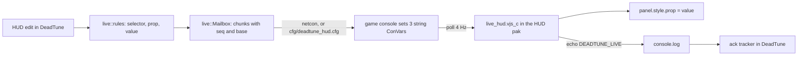

# Live HUD preview (restyle the running game's HUD without a restart)

Status: design and first build, 2026-10-06. Nothing proven in game yet; the probes in section 8 and the LH checks in `docs/testing-windows.md` settle the unknowns. Research: `research/hud/panorama-runtime.md`, `docs/plans/ingame-settings/plan.md`.

## 1. The problem

Two facts fix the shape of this feature:

- The running game locks DeadTune's HUD pak (`pak77_dir.vpk`: "Access is denied (os error 5)" even as administrator), so nothing new can be shipped while the game runs.
- Retail Panorama has no reload command (`find reload`, `find panorama`: nothing; `dump_panorama_events` lists only generic style events). A pak change is seen at the next game start.

What Panorama does offer is `panel.style.<prop> = value` from a script that is already loaded, and every HUD edit DeadTune makes is a CSS rule, so a script shipped in the pak once can restyle the HUD at runtime if DeadTune can hand it the current rules.

## 2. Design in one picture



The script is opt-in ("Live HUD preview", off in Vanilla). It ships in the HUD pak with a `base` id, the hash of the rules the pak baked, so DeadTune knows which pak the game runs and sends overrides relative to it.

## 3. Data channel

### 3.1 Options weighed

| Option | Write side | Read side | Verdict |
|---|---|---|---|
| (a) ConVars set through the console, read in JS | Proven: the console bridge sets any non-dev ConVar; `echo` replies come back through `console.log` | `GameInterfaceAPI.GetSettingString` / `GetSettingValue` are the Source 2 Panorama reads (section 3.2 lists the evidence from the game's own scripts) | Chosen |
| (b) Hidden `CitadelSettingsSlider` bound to a float ConVar | Same console write | The slider's `Value` text box, read like `ingame_settings.js` does; only floats, 7 significant digits, one value per slider | Fallback if (a)'s read API is missing: one float carries one `element.prop=value` message, so a full layout takes seconds |
| (c) A loose file the script loads (`BLoadLayout`, `$.LoadKeyValues`) | DeadTune writes a file under `game/citadel/panorama/` | Resource loads are cached by path and the engine may refuse loose files behind a VPK | Not pursued: unknown caching, and it writes into the game folder |
| (d) The script `exec`s a DeadTune cfg itself | DeadTune writes `cfg/deadtune_hud.cfg` atomically | The cfg sets the same ConVars as (a); no key press, no netcon | Used as the transport for (a) when netcon is off (section 3.4) |

### 3.2 Reading a ConVar from Panorama JS

The game's own scripts never read a ConVar from JS: retail ships only six compiled post-game scripts, `hud.xml` has no `<scripts>` block, commands go through `$.DispatchEvent("CitadelConCommand", line)` (77 sites), and Mixboat's Wide FOV mod reads values from a slider's DOM, never from a ConVar API. `GameInterfaceAPI.GetSettingString(name)` is the Source 2 Panorama name known from Dota 2; the script calls it in one `readSlot` function and the hello line prints what it returned, so LH-P1 answers it in one launch. If it is missing, the fallback is option (b): hidden `CitadelSettingsSlider`s (section 3.1).

### 3.3 The mailbox ConVars

String-typed, client-side, not cheat, not dev-only, not archived, not denylisted, with no effect on a client (from the full dump `research/configs/OptimizationLock/cvarlist.txt`):

| ConVar | Flags | Default | Why it is safe |
|---|---|---|---|
| `iv_debugbone` | release | empty | "Debug bone name for interpolation spew"; only read by dev-only spew nobody can turn on in retail |
| `tv_title` | release | `SourceTV` | SourceTV spectator title; a client never serves SourceTV |
| `tv_name` | release | `SourceTV` | SourceTV host name; same |

None is archived, so nothing lands in `user_convars_*.vcfg`; DeadTune still sets each back to its default when the preview ends (game closed, toggle off, DeadTune exit) and the console ack shows whether the set took. `panorama_debugger_theme` (cl, a, string) was rejected because it is archived; `hostname`, `sv_logsdir`, `net_public_adr` because the sandbox runs a listen server. Each slot carries one chunk; the script polls all three every 250 ms.

### 3.4 Transport

DeadTune writes `cfg/deadtune_hud.cfg` (temp file and rename, like `deadtune_live.cfg`) with three `name "chunk"` lines. The script runs `exec deadtune_hud` itself, so the file is read with no key bound and no netcon. When the bridge is netcon, DeadTune also sends the same lines directly for lower latency. The exec of an unchanged file re-sets the same values, which is a no-op. At session end DeadTune writes the resets into the same file so the next poll restores the ConVars, then empties it.

Console spam: if `exec` prints a line per call (LH-P2 measures it), a 4 Hz exec would add 14,400 lines an hour to `console.log`. So the exec runs at an idle rate of once a second until a chunk arrives, then at the hot rate (every 250 ms) for 10 s after the last chunk, then idle again; ConVar reads and restyling cost no console lines and stay at the hot rate while anything is styled. First-edit latency is therefore up to 1 s, later edits in a session up to 250 ms. If LH-P2 shows `exec` printing even at 1 Hz, the cfg transport is turned off in the script's config (`cfg: ""`) and netcon becomes the only transport.

Known gap: if DeadTune dies mid-session, the file keeps the last state and the next game start shows it until DeadTune runs again (the base check in 3.5 still prevents double application after an Apply).

### 3.5 Message format and baseline

Chunk value (no `"`, `;` or line breaks, per `ConsoleCmd::to_line`):

```
dt1 <seq> <i>/<n> <base> <kind> <payload>
```

- `seq`: per-session counter; the script applies a message once all `n` chunks of the newest `seq` are present and in order.
- `base`: eight hex digits of the sha256 of the rules the pak baked (`live::base_id`). The script carries its own `base` from the pak; a message for another base is ignored and answered with `DEADTUNE_LIVE <seq> wrongbase <own base>`.
- `kind`: `full` replaces the whole override set (keys missing from it are reset); `patch` merges keys.
- `payload`: records `selector^prop^value` separated by `~`; `%`, `~`, `^`, `"`, `;` and line breaks inside values are percent-escaped.

Overrides are absolute inline values, because an inline style always wins over the baked stylesheet and there is no way to drop a baked rule. For every key (selector, prop) in desired ∪ baked, the message carries the desired value, or the prop's vanilla reset when the desired layout dropped it (`live::RESETS`: `transform: none`, `opacity: 1`, `ui-scale` from `ELEMENTS`, `pre-transform-scale2d: 1`, `saturation|brightness|contrast: 1`, `hue-rotation: 0deg`, `visibility` per the element's vanilla state). A key equal to its baked value is sent too (harmless, and it makes "back to what Apply baked" exact). The baked layout comes from `hud.toml`'s recorded layout; if the game's announced base matches no record, the preview stays off with "Restart the game to use live preview".

Acks: the script answers every applied message with `echo DEADTUNE_LIVE <seq> ok <base>`, announces `DEADTUNE_LIVE hello <base>` when it loads and every 10 s. DeadTune's ack tracker reads both from `console.log` (`-condebug`, already required for pushes). A slot is reused only after its message is acked or 1 s passed; after a timeout the next message is `full`.

## 4. Mapping: which edits go live

`live::rules(layout)` compiles the layout exactly as Apply does (`layout::compile`), parses every emitted style file (`css::parse_rules`) and keeps a rule when both hold:

1. Its selector list uses only `#id`, `.class`, `Tag`, `:not(.class)`, descendant spaces and commas. `>`, `:hover`, `:active`, `:selected`, `::`, attribute selectors and at-rules are not live.
2. Every property is in `live::LIVE_PROPS`, and either has a reset in `live::RESETS` or the selector has no class part (ids and tags only cannot un-match while the panel exists).

The script matches selectors itself with `FindChildTraverse`, `FindChildrenWithClassTraverse`, `BHasClass` and `paneltype`, re-evaluating each poll so panels created later (minimap markers) get their style; a panel that stops matching is reset.

| DeadTune edit | Selector | Live property | Live? |
|---|---|---|---|
| Layout move | `ELEMENTS` selector | `transform: translateX() translateY()` | yes |
| Layout scale | same | `ui-scale` or `pre-transform-scale2d` + `transform-origin` | yes |
| Layout fade, hide, show | same | `opacity`, `visibility` | yes |
| Minimap icon colours | `#hud_minimap .map_button... #BackgroundImage` | `wash-color` (and `background-color` where the generator uses it) | yes (reset from the vanilla stylesheet, else restart) |
| Minimap marker sizes, map opacity | `hud_minimap.vcss_c` rules | `width`, `height`, `opacity` | sizes need restart to undo; opacity live |
| Minimap frameless | rules on frame panels | `visibility`, `opacity` | yes |
| Top bar missing-portrait dimming, dead look | `.HealthVisible`-keyed rules | `opacity`, `saturation`, `brightness` | yes, at the 250 ms poll (state class) |
| Top bar portrait scale and gap | portrait rules | `ui-scale`, `margin-*` | scale live; gap needs restart to undo |
| Top bar colours | `wash-color`, `background-color` | yes (reset as minimap colours) |
| Top bar extras (spawn timers, urn lead, purchases) | script and panels | | needs Apply and a restart |
| Health bar | `hud_health*.vcss_c` rules | `width`, `height`, `opacity`, `transform`, `font-size`, `color` | per property; geometry needs restart to undo |
| Player stats | eight style files | `ui-scale`, `font-size`, `color`, `opacity`, `background-color`, `border-radius` | per property |
| Apples and tunnels | panels in `hud_minimap.vxml_c` | | needs Apply and a restart |
| In-game settings rows | panels in `popup_settings` | | needs Apply and a restart |
| UI images | replaced textures | | needs Apply and a restart (a `background-image` swap between existing images would be live; nothing in DeadTune emits one yet) |
| Custom CSS | whatever parses | by the two rules above | per rule |
| Image colour edits (tint, hue, saturation, brightness, contrast) | baked into images | | needs Apply and a restart; the same look is available live as `wash-color`, `hue-rotation`, `saturation`, `brightness`, `contrast` on the panel, which is how a future "preview before baking" would work |

`live::coverage(layout)` returns the features and rules that are not live, and every HUD page shows them as "Needs Apply and a restart: ...". The test `every_element_edit_is_live` checks all ten `ELEMENTS` rows for move, scale, fade, hide and show; `generators_classify_without_panics` runs every generator at its non-vanilla extremes through the classifier.

## 5. GUI

State machine `LiveHud` (`crates/dt-gui/src/live_hud.rs`), one value in `AppState`:

| State | Shown on HUD pages | Enters on |
|---|---|---|
| `Off` | nothing | toggle off |
| `NotInstalled` | "Turn on Live HUD preview, Apply, and restart the game once" (toggle on, pak without the script) | toggle on; record lacks `HudFeature::LivePreview` |
| `GameClosed` | "Live preview starts when the game runs" | script installed, game not running |
| `Waiting { since }` | "Looking for the live script in game…" ; after 20 s adds "launch through DeadTune so `-condebug` is on" | game running, no hello yet |
| `Stale { base }` | "The game is running an older HUD; restart it to preview live" | hello base matches no record |
| `Live { base, seq, acked }` | green "Live in game" and "Undo live changes" | hello base matches the record |
| `Error(String)` | the message | a push or file write failed |

Edits on any HUD page call `LiveHud::schedule(layout)`; `tick` sends after a 100 ms debounce, respecting the one-message-in-flight rule. "Undo live changes" sends a `full` message built from the baked layout alone (every live key at its baked value, every earlier live key reset) and marks the state as undone until the next edit. The toggle lives on the Layout page's toolbar with a hint; it is a `HudLayout` field, so Apply bakes the script and the Vanilla preset turns it off.

Screenshot lever: `DEADTUNE_FAKE_LIVE_HUD=off|not_installed|closed|waiting|stale|live|error` injects the state on the Layout page.

## 6. Tests

- `hud::live` (dt-core): codec round trips with every escaped character; chunking at the limit and reassembly in order; mailbox sequencing (ack gating, slot reuse, timeout promotes to `full`); `base_id` is deterministic and ignores the `live` flag itself; every `ELEMENTS` row's five edits produce live rules; every generator classifies without panics and the not-live list names the expected features; the generated script carries the base and compiles into a stand-in HUD layout through `inject::patched_layout` and `script_resource`, and the whole pak passes `addons::verify` like the in-game settings test.
- `live_hud` (dt-gui): every transition above from the events (toggle, record, game running, hello, ack, edit, timeout), and the debounce.
- JS: no engine without a new crate, so the script stays data-driven: the Rust side validates selectors to the token grammar the script's one regex understands, and the codec test fixtures double as the script's documented input.

## 7. Windows checks

`docs/testing-windows.md` section 7e: LH-P1 to LH-P5 probes, then LH-1 to LH-8.

## 8. Unknowns and probes

| Unknown | Probe | If it fails |
|---|---|---|
| JS can read a ConVar the console just set | LH-P1: set `tv_title` in the console; the script's hello line reports what `GetSettingString("tv_title")` returns | hidden-slider fallback (b) |
| `exec` runs from `CitadelConCommand` | LH-P2: the hello line stops reporting `exec` as refused; `deadtune_hud.cfg` with `echo DEADTUNE_LIVE probe` shows that line in `console.log` | netcon only, or the bound key |
| Longest value a console line accepts | LH-P3: chunks of 100, 200, 400, 1000 characters; the ack reports which seq arrived whole | chunk size constant |
| Inline style resets (`wash-color`, `visibility`) really clear | LH-P4: hand-typed `tv_title` messages fade, tint and hide the top bar and minimap, then an empty `full` message puts them back | shrink `RESETS`; the props that do not clear become "needs a restart to undo" |
| The HUD root layout keeps our script across game states (hideout, death replay) | LH-P5: hello lines keep coming after a death | move the include to a layout that stays loaded |

## 9. Checkpoint (throughput)

- Blocking first: the data shape (`LiveRule`, `Message`, `LiveHud`) and the four gates on the core module before the GUI starts.
- Independent workstreams: dt-core `hud::live` and the GUI state machine touch disjoint files; docs run alongside.
- Shared mutable state: `layout.rs` (one field, one feature), `state.rs` (hooks); one writer each.
- Smallest decomposition: core then GUI, one owner each, with review between.
