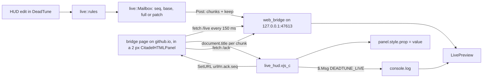

# Live HUD preview (restyle the running game's HUD without a restart)

Status: third design, 2026-10-08. The hidden-slider channel of the second design is dead (section 2), so messages now travel through the game's own web panel and a static bridge page on GitHub Pages (section 3). Check live preview (section 9) settles what is left on Windows. Research: `research/hud/panorama-runtime.md`, `docs/plans/ingame-settings/plan.md`.

Credit: the web-panel bridge, the title and fragment channel, the restore at HUD load and the ready handshake follow ideas from QOL Lock 4.0.5 by Predi_i and BubbleGumXD (`github.com/civo7/QOLLOCK`, `docs/core/storage_bridge.md`). QOL Lock has no licence, so DeadTune takes only the ideas; every line here is our own.

## 1. The problem

Two facts fix the shape of this feature:

- The running game locks DeadTune's HUD pak (`pak77_dir.vpk`: "Access is denied (os error 5)" even as administrator), so nothing new can be shipped while the game runs.
- Retail Panorama has no reload command (`find reload`, `find panorama`: nothing). A pak change is seen at the next game start.

What Panorama does offer is `panel.style.<prop> = value` from a script that is already loaded, and every HUD edit DeadTune makes is a CSS rule, so a script shipped in the pak once can restyle the HUD at runtime if DeadTune can hand it the current rules. The hard part is the hand-over: a Panorama script can read neither a ConVar nor a file.

## 2. Evidence from Windows

v0.17.0 (Simon, 2026-10-06): the script loads from the HUD pak and `$.DispatchEvent("CitadelConCommand", ...)` runs `exec` and `echo`, but every `exec` prints a console line and `GameInterfaceAPI.GetSettingString` does not exist.

v0.24 to v0.26 (Simon, 2026-10-07 and 08), all in the game's HUD:

- The script loads and its `$.Schedule` timers keep running (`alive 3s polls=3`, `alive 10s polls=29`). `$.Msg` lines reach `console.log` as `[PanoramaScript] ...`.
- The hidden `CitadelSettingsSlider` channel is dead: all ten sliders load (`n=10`) but read 0, even after the boot cfg set their ConVars. `GameInterfaceAPI` does not exist at all.
- `$.CreatePanel("CitadelHTMLPanel", ...)` works and `$.RegisterEventHandler("HTMLTitle", panel, fn(panel, title))` fires. `SetURL` to `http://127.0.0.1:47613/...`, `http://localhost:47613/...` and a `data:` URL all ended at title `about:blank`, and DeadTune's server saw no request. The game's 2026-10-01 update made `SetURL` HTTPS-only (QOL Lock used `javascript:` URLs before it and moved to an HTTPS page after).
- Creating and at once deleting a `CitadelHTMLPanel` (the old hello probe) seemed to stop the script, so the script never deletes a panel.

## 3. Data channel

### 3.1 Options weighed

| Option | Verdict |
|---|---|
| (a) ConVars read through `GameInterfaceAPI` | Dead: the API does not exist |
| (b) Hidden `CitadelSettingsSlider` panels bound to inert `tv_` ConVars | Dead: they load but read 0 (v0.24 to v0.26); removed |
| (c) A loose file the script loads | Not pursued: caching unknown, writes into the game folder |
| (d) The script runs `exec` to pull a cfg | Out: one console line per exec, and the cfg could only set ConVars nobody can read |
| (e) Web panel and an HTTPS bridge page | Chosen. The game loads only HTTPS, so the page lives on GitHub Pages; the page may fetch `http://127.0.0.1` (a secure context to Chromium) with CORS and private network headers |

### 3.2 Pieces

- **Script** (`assets/live_hud.js`, config `var DT_LIVE = { base, page, port, protocol, poll, retry, retries }`). On load it creates one `CitadelHTMLPanel` (2 px, opacity 0.01, visible so Chromium's timers run, no hit test, never deleted), registers `HTMLTitle` and opens `https://simulieren.github.io/deadtune/bridge/?port=47613&base=<base>`. A second panel loads `http://127.0.0.1:47613/control` once as the control: its title in the log shows whether the game still refuses plain HTTP. It answers only through `$.Msg` (`DEADTUNE_LIVE ...`) and the URL fragment, never with a console command. One `hello <base> web=panel|nopanel` at load, `alive 10s` once, `web <report>` once per distinct page report, `<seq> ok <base>` per applied message, `<seq> wrongbase <base>`.
- **Page** (`docs/bridge/index.html`, dependency-free, no requests anywhere but 127.0.0.1). Every title it sets is `DTLIVE:v1 <counter> <body>`; the counter makes each title distinct, so the script drops the repeats the panel delivers. Bodies: `ready storage=ok|no` (after testing `localStorage`), `fetch ok`, `fetch blocked <error>`, the message chunks, `restore dt1 ...` and `restore none`. It polls `/live?since=<seq>&base=<base>` every 150 ms (`&hello=1` on its first poll), backs off to 5 s while DeadTune is unreachable, and sets one title every 40 ms. `sw.js` keeps a copy of the page for when GitHub is unreachable (network first, so updates land at once).
- **Server** (`hud::web_bridge`, 127.0.0.1 only, a thread per connection). `GET /live` answers JSON `{seq, chunks, keep}` for the latest message when its seq differs from `since`, else 204; a `hello=1` poll drops the posted message (it may be a patch for the last script) and tells the GUI. `GET /ack?seq=N` records an ack. `OPTIONS` answers the preflight. Every answer carries `Access-Control-Allow-Origin: https://simulieren.github.io`, `Access-Control-Allow-Private-Network: true`, methods and headers. `/live`, `/ack` and preflights from any other `Origin` (or none) get 403; only `/control`, a plain navigation, needs none. Counters (polls, page starts, delivered, acks, preflights, plain http loads, refused) go into the check's report.
- **No per-session token.** The script is baked into the pak at Apply and can't learn a value DeadTune picks at start, and anything baked into the pak is readable by every local program. Browsers can't forge `Origin`, and only simulieren's own GitHub Pages carry that origin, so the `Origin` check is the guard.

### 3.3 Message format

A message is the records `selector^prop^value` joined by `~`, each field percent-escaped (`%`, `~`, `^`, spaces, control characters and non-ASCII), so the payload is printable ASCII without spaces: a page title collapses whitespace. `live::titles` cuts it into chunks of 200 characters, each `dt1 <seq> <i>/<n> <base> full|patch <part>`; `full` replaces the script's override set, `patch` merges. The script joins the parts in order before decoding, keeps chunks per seq, ignores a seq it already applied, and answers a message for another base with `wrongbase`.

`base` is eight hex digits of the sha256 of the styles and layout edits the pak baked. The first message of every session, and of every new page, is `full`. Seq is never 0 (a new page asks for anything other than 0).

### 3.4 Handshake, acks and restore

- **Ready.** The page's first title is `ready`. A title with another `DTLIVE:` version is an old cached page: the script loads it again with `&r=<n>`. With no `ready` after 20 s the watchdog loads it again, up to five loads in all.
- **Fragments.** The script asks through `SetURL(url + "#<n>.ack.<seq>")` and `#<n>.restore`; only the fragment changes, so the page gets a `hashchange` and no reload. A fragment present when the page loads is never acted on (a reload never replays a request), and such a load sends no `hello`, so a game that reloads instead of firing `hashchange` can't loop.
- **Acks** count from either path: the page's `/ack` and the console's `ok` line.
- **Restore at HUD load.** With each message DeadTune posts `keep`, the whole override set as a `full` message under the same seq. When the script acks a seq the page saves its `keep` in `localStorage` (the game's browser profile keeps it across restarts). Right after `ready` the script asks for it; the page answers with `restore dt1 ...` chunks when the saved base matches, else `restore none`. A restore counts only while no message from DeadTune has started to arrive, so it never overwrites a newer edit. Live edits therefore survive a game restart until Apply bakes them, even before DeadTune is running.

## 4. Mapping: which edits go live

`live::rules(layout)` compiles the layout exactly as Apply does (`layout::compile`), parses every emitted style file (`css::parse_rules`) and keeps a rule when both hold:

1. Its selector list uses only `#id`, `.class`, `Tag`, `:not(.class)`, descendant spaces and commas. `>`, `:hover`, `:active`, `:selected`, `::`, attribute selectors and at-rules are not live.
2. Every property is in `live::LIVE_PROPS`, and either has a reset in `live::RESETS` or the selector has no class part (ids and tags only cannot un-match while the panel exists).

The script matches selectors itself with `FindChildTraverse`, `FindChildrenWithClassTraverse`, `BHasClass` and `paneltype`, re-evaluating each poll so panels created later (minimap markers) get their style; a panel that stops matching is reset.

| DeadTune edit | Selector | Live property | Live? |
|---|---|---|---|
| Layout move | `ELEMENTS` selector | `transform: translateX() translateY()` | yes |
| Layout scale | same | `ui-scale` or `pre-transform-scale2d` + `transform-origin` | yes |
| Layout fade, hide, show | same | `opacity`, `visibility` | yes |
| Minimap icon colours | `#hud_minimap .map_button... #BackgroundImage` | `wash-color` (and `background-color` where the generator uses it) | yes (reset from the vanilla stylesheet, else restart) |
| Minimap marker sizes, map opacity | `hud_minimap.vcss_c` rules | `width`, `height`, `opacity` | sizes need restart to undo; opacity live |
| Minimap frameless | rules on frame panels | `visibility`, `opacity` | yes |
| Top bar missing-portrait dimming, dead look | `.HealthVisible`-keyed rules | `opacity`, `saturation`, `brightness` | yes, at the 250 ms poll (state class) |
| Top bar portrait scale and gap | portrait rules | `ui-scale`, `margin-*` | scale live; gap needs restart to undo |
| Top bar colours | `wash-color`, `background-color` | yes (reset as minimap colours) |
| Top bar extras (spawn timers, urn lead, purchases) | script and panels | | needs Apply and a restart |
| Health bar | `hud_health*.vcss_c` rules | `width`, `height`, `opacity`, `transform`, `font-size`, `color` | per property; geometry needs restart to undo |
| Player stats | eight style files | `ui-scale`, `font-size`, `color`, `opacity`, `background-color`, `border-radius` | per property |
| Apples and tunnels | panels in `hud_minimap.vxml_c` | | needs Apply and a restart |
| In-game settings rows | panels in `popup_settings` | | needs Apply and a restart |
| UI images | replaced textures | | needs Apply and a restart (a `background-image` swap between existing images would be live; nothing in DeadTune emits one yet) |
| Custom CSS | whatever parses | by the two rules above | per rule |
| Image colour edits (tint, hue, saturation, brightness, contrast) | baked into images | | needs Apply and a restart; the same look is available live as `wash-color`, `hue-rotation`, `saturation`, `brightness`, `contrast` on the panel, which is how a future "preview before baking" would work |

`live::coverage(layout)` returns the features and rules that are not live, and every HUD page shows them as "Needs Apply and a restart: ...". The test `every_element_edit_is_live` checks all ten `ELEMENTS` rows for move, scale, fade, hide and show; `generators_classify_without_panics` runs every generator at its non-vanilla extremes through the classifier.

## 5. GUI

State machine `LivePreview` (`crates/dt-gui/src/live_hud.rs`), one value in `AppState`. Each frame `AppState::tick_live` hands it the bridge's news (`Bridge::take`: a page start, the page's base, the last poll, acks) and posts what `tick` returns (`Delivery::Post`, or `Delivery::Clear` when a session ends). The server wakes the window on a page start, an ack, or a page coming back. The line every HUD page shows comes from `LivePreview::status`:

| State | Line | Enters on |
|---|---|---|
| `Off` | nothing | switch off, Vanilla (no pak), Ranked-safe (pak taken out) |
| `NotInstalled` | "Apply to add the live script to your HUD; Deadlock loads it when it starts" | the installed pak lacks `HudFeature::LivePreview` |
| `GameClosed` | "Live preview starts when Deadlock runs" | script installed, game not running |
| `Stale` | "Deadlock is running the HUD from before your last Apply. Close Deadlock, then press Launch." | the game started before the pak was written, or the script or page named another base |
| `Waiting` | "Looking for the live script in game..." for 20 s; then "The live script runs, but its page hasn't reached DeadTune. Press Check live preview." when the log had a hello, else where the console log stands | game running, no page poll within 2 s |
| `Live` | "Live in game"; "Undo live changes" | the script said hello (log or page) with the installed base and the page polled within 2 s |
| `Error` | the message | the layout can't be read |

A page start or a hello is a fresh script: the mailbox sends everything again as `full`. While a HUD change waits for the game to close (`PendingPaks`), `NotInstalled`, `Stale` and `Waiting` read "Your last Apply waits until Deadlock closes. Close Deadlock, then press Launch." instead. The boot cfg no longer binds anything for the HUD, and no `deadtune_hud.cfg` is written.

Screenshot lever: `DEADTUNE_FAKE_LIVE_HUD=off|not_installed|closed|waiting|waiting_long|waiting_page|stale|stale_base|live|error`.

## 6. Tests

- `hud::live` (dt-core): codec round trips, chunking and reassembly in any order, a trimmed title, mailbox sequencing, replacement, timeout and `keep`, live coverage of every element and generator, the script in the stand-in HUD layout.
- `hud::web_bridge`: request parsing, CORS and private network headers on every answer, the `Origin` guard, JSON, a page start dropping the posted patch, acks, a real server on 127.0.0.1.
- `tests/live_bridge.rs`: the real script and the real page in Node (`tests/fixtures/live_hud_sim.js`: a `CitadelHTMLPanel` that loads only https, delivers every title twice and turns fragment-only `SetURL` into `hashchange`) against DeadTune's real server and a thread playing the window. Edits reach the panels applied once each with no console command; saved edits come back without DeadTune; a restore gives way to a newer message, also one that arrives late; a page reloaded with a fragment neither replays it nor says hello; a page that never loads is retried five times. Skipped where Node is missing.
- `live_hud` (dt-gui): every transition with page news, the debounce, either ack path, the status lines. `state::tests`: a console hello, a page start, the posted full message, the ack and an edit's patch through `AppState`.
- `hud::live_check`: every sample's next step, the page without a console log, a blocked fetch, a busy port, the report's counters.

## 7. Windows checks

`docs/testing-windows.md` section 7e: press Check live preview (section 9); when it isn't green, its report answers the unknowns below.

## 8. Unknowns

| Unknown | Probe | If it fails |
|---|---|---|
| The game's browser lets a github.io page fetch `http://127.0.0.1` | Report row "The bridge page reaches DeadTune", `web fetch ok` or `web fetch blocked <error>`, the server's preflight count | try `https://` on 127.0.0.1 with a local certificate, or a WebSocket |
| HTMLTitle keeps up with a title every 40 ms | `alive 10s ... titles=` against the chunks sent; the test minimap applies | slow the pump |
| A fragment-only `SetURL` keeps the page (no reload) | Server acks against the console's `ok` lines | rely on the console's `ok` |
| `localStorage` persists in the game's browser profile | `web ready storage=ok`, then `web restored <seq>` after a restart | none needed; the preview still works |
| Inline resets (`wash-color`, `visibility`) clear | Undo live changes, by eye | shrink `RESETS` |
| The script survives game states | Check live preview after a match or the hideout | move the include to a layout that stays loaded |

## 9. Check live preview

Simon is the only tester, so the check does the reading. One button on every HUD page (next to the live line) and in System check.

1. **Visible test.** When a session runs, DeadTune sends `live_check::test_layout` in place of the profile's layout (`LivePreview::flash`): the minimap at 150%, pulled toward the centre. When the script applies that message (page ack or console `ok`) the card counts 5 s, the layout goes back and it asks "Did the minimap get bigger for a few seconds?". Yes is green. No, or no ack within 20 s, goes to the diagnosis. With no session the diagnosis runs at once.
2. **Diagnosis.** `hud::live_check::diagnose` is pure over `Facts`: game running and its start time, the newest console log read whole (the session starts at the last `DEADTUNE_BOOT`), the pak read back (the script's base), a pending HUD change, the server's facts (`WebFacts`: listening or why not, counters, last poll, the page's base, recent acks) and the test. Rows: game running; console log (a warning only, when the page reaches DeadTune anyway); the HUD carries the script; the game runs that HUD; the script runs (hello in the log, or the page); the bridge page loaded in game (`web ready`, whether it can keep edits, every `web` report as detail, the control load's title among them); the page reaches DeadTune (the server's count, or the browser's error, or the busy port); script errors; the minimap test. The one next step: turn on, start the game, Apply, close and Launch, send the report with a plain reason (script didn't start, no web panel, page didn't load, fetch blocked, port busy, applied but not seen), or try again.
3. **Report.** `live_check::report` is the checklist, the next step, the server's counters, every DeadTune line of the session (last 200), the error lines and the last 50 lines. Copy report puts it on the clipboard; it is always saved to `<data>/reports/live-hud-<time>.txt`.

Samples for every situation (`live_check::SAMPLES`) back the tests and the screenshot lever `DEADTUNE_FAKE_LIVE_CHECK`; `scripts/live-check-shots.sh` renders them all.

## 10. Next

The same bridge can save the in-game settings rows (`docs/plans/ingame-settings/plan.md`) the moment they change, as QOL Lock does for its settings menu. Not now: the HUD preview comes first.
